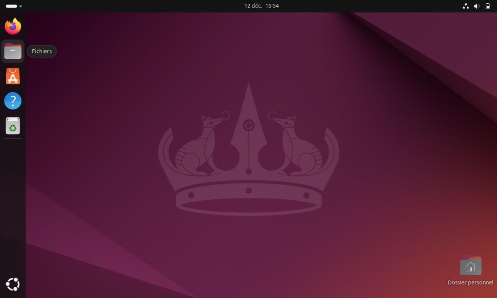
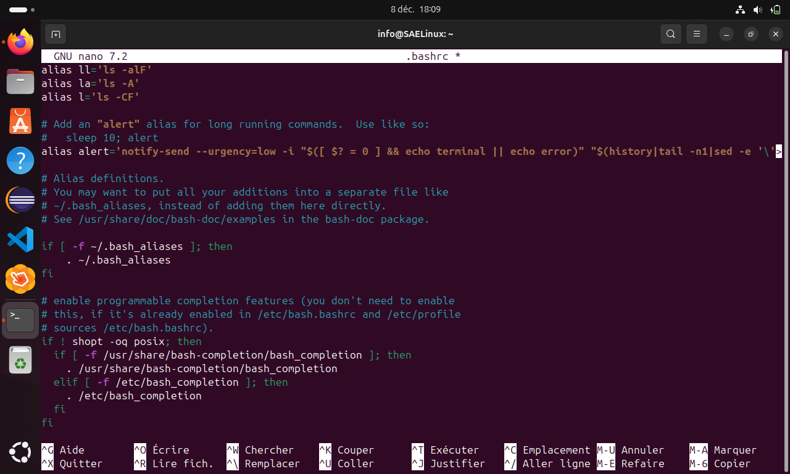
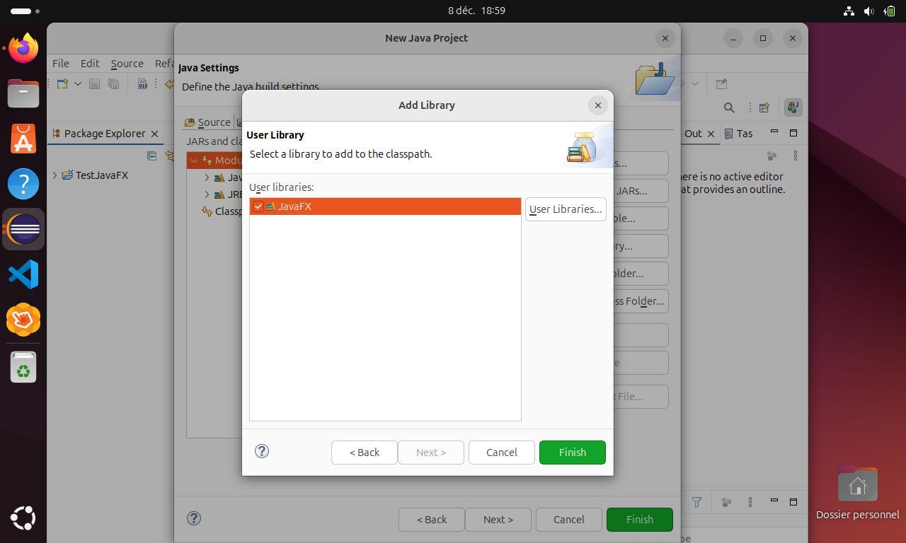
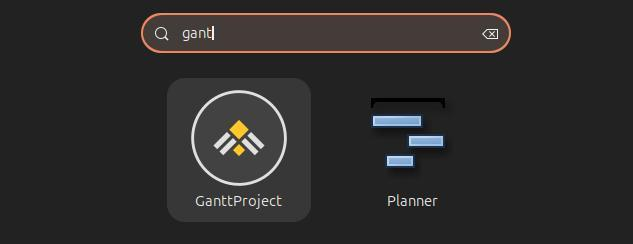

# 🐧 Poste de développement Linux

Installation et configuration d'une machine virtuelle Ubuntu pour disposer d'un environnement de développement en **C/C++, assembleur et Java/JavaFX**. Le projet couvre la préparation de la VM, les comptes utilisateurs, les logiciels, le shell et la configuration d'Eclipse avec Scene Builder.

J'ai réalisé l'intégralité de la partie technique et rédigé l'essentiel du guide d'installation. La documentation explique les manipulations pas à pas, avec des captures, pour permettre à une personne débutante de reproduire l'installation.

**[📖 Consulter le guide PDF](docs/guide-installation.pdf)** · **[📝 Télécharger le guide Word](docs/guide-installation.docx)**

## 🎯 Objectif

Préparer un poste Linux réunissant les outils nécessaires pour programmer, compiler, déboguer et concevoir des interfaces JavaFX. La virtualisation permet de disposer de cet environnement à côté du système de l'ordinateur hôte.

Le guide décrit la mise en place d'Ubuntu 24.04 LTS dans VirtualBox. Il présente les réglages de ressources de la VM, l'installation des logiciels et les manipulations de configuration. Le dépôt contient la documentation et des captures de la réalisation ; le disque de la machine virtuelle n'y est pas inclus.

## 🛠️ Technologies et outils

| Domaine | Outils et configuration |
| --- | --- |
| Virtualisation | Oracle VirtualBox, installation depuis une image ISO Ubuntu |
| Système | Linux Ubuntu, comptes utilisateurs, droits administrateur |
| Installation des logiciels | APT, Snap et paquets `.deb` |
| Développement C/C++ | `build-essential`, GCC/G++, GDB et DDD |
| Assembleur et diagnostic | NASM, `strace`, outils d'observation des processus |
| Développement Java | JDK, Eclipse, OpenJFX et Scene Builder |
| Éditeurs | Visual Studio Code, Vim, Nano et Gedit |
| Shell | Bash, alias dans `.bashrc`, `umask`, variable `PATH` |
| Planification de projet | Planner et GanttProject |

## ⚙️ Réalisation technique

- **Création de la VM** : choix de l'image système, allocation de la mémoire, des processeurs et du disque, puis démarrage d'Ubuntu.
- **Gestion des comptes** : manipulation du compte utilisateur, des privilèges et des sessions administrateur dans le cadre de l'exercice.
- **Installation de l'environnement** : compilateurs, débogueurs, éditeurs, JDK et outils graphiques.
- **Personnalisation du terminal** : configuration de Bash, alias, droits par défaut avec `umask 027` et coloration syntaxique de Vim.
- **Configuration d'Eclipse** : ajout de la bibliothèque JavaFX et association de Scene Builder.
- **Dépannage** : documentation d'une installation de paquet interrompue et de sa reprise avec les outils APT et dpkg.
- **Documentation** : rédaction d'un parcours illustré, de l'installation de VirtualBox jusqu'aux outils de planification.

## 🖼️ Aperçu de la configuration

### Configuration du shell

### Intégration de JavaFX dans Eclipse

### Outils de planification installés

Les captures proviennent du guide réalisé pendant le projet. Elles illustrent l'installation et la configuration ; la présence d'une bibliothèque dans Eclipse ne suffit pas à démontrer l'exécution d'une application JavaFX.

## 📚 Parcourir le guide

| Partie | Pages |
| --- | --- |
| Prérequis matériels et logiciels | 2 à 4 |
| Création et démarrage de la machine virtuelle | 4 à 7 |
| Comptes et privilèges | 8 à 11 |
| Installation des outils de développement | 12 à 23 |
| Configuration de Bash et Vim | 24 à 28 |
| JavaFX, Eclipse et Scene Builder | 29 à 44 |
| Planner et GanttProject | 45 à 48 |

## 🧭 Repères pour reproduire l'installation

Le guide conserve les captures et les versions utilisées pendant le projet. Les interfaces et les paquets disponibles peuvent évoluer. Pour télécharger les logiciels, utiliser les sites officiels et sélectionner les versions adaptées au système invité et à son architecture.

Les comptes de démonstration et l'assouplissement des règles de mots de passe des pages 8 à 10 correspondent au contexte d'exercice. Pour un poste utilisé au quotidien, conserver une politique de mots de passe robuste et privilégier `sudo` pour les opérations d'administration, conformément au fonctionnement habituel d'Ubuntu. [Documentation Ubuntu](https://ubuntu.com/server/docs/how-to/security/user-management/).

L'ajout de `.` au `PATH` montré dans le guide permet de rechercher des exécutables dans le répertoire courant. Pour un usage courant, préférer leur lancement explicite avec `./programme`, afin de choisir clairement le fichier exécuté.

Dans Eclipse, une extension de prise en charge d'une version de Java et l'installation du JDK sont deux opérations distinctes. La configuration peut être contrôlée dans les préférences des JRE installés ainsi qu'avec `java -version` et `javac -version` dans le terminal. Le guide documente la réalisation ; aucune nouvelle exécution de la VM n'a été effectuée pour cette publication.

## 👤 Ma contribution

J'ai assuré toute l'installation et la configuration technique de la machine virtuelle, ainsi que la majeure partie de la rédaction du guide. Un camarade a ensuite finalisé la documentation. Les auteurs du livrable collectif sont crédités dans le guide.

Ce projet m'a permis de travailler l'administration d'un poste Linux, la gestion des logiciels et des droits, la préparation d'un environnement de développement et la rédaction d'instructions compréhensibles par un utilisateur débutant.

## 🔗 Ressources officielles

- [VirtualBox](https://www.virtualbox.org/)
- [Ubuntu Desktop](https://ubuntu.com/download/desktop)
- [Eclipse IDE](https://www.eclipse.org/ide/)
- [OpenJFX](https://openjfx.io/)
- [Scene Builder](https://gluonhq.com/products/scene-builder/)
- [GanttProject](https://www.ganttproject.biz/)
